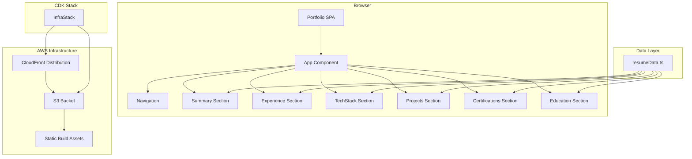
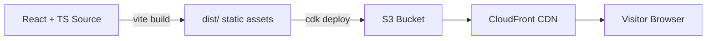

# Design Document: Online Portfolio

## Overview

This design describes a dark-themed, single-page portfolio/resume website for Joel A. Hyman, built with React and TypeScript. The site presents professional information across six content sections — Summary, Work Experience, Tech Stack, Side Projects, Certifications, and Education — with smooth-scroll navigation and responsive layout from 320px to 2560px viewports. The application produces a static build deployed to AWS S3 and served through CloudFront, with infrastructure managed by AWS CDK.

### Key Design Decisions

1. **Vite as build tool**: Vite provides fast development builds and optimized static output for production. It's the modern standard for React + TypeScript projects and produces clean static assets suitable for S3 hosting.
2. **CSS Modules for styling**: CSS Modules provide scoped styles per component without runtime overhead, keeping the bundle small for a static site. No CSS-in-JS library needed.
3. **CSS custom properties for theming**: A centralized set of CSS custom properties (variables) defines the dark theme palette, typography scale, and spacing. This ensures consistency and makes future theme adjustments trivial.
4. **Single data file pattern**: All resume content lives in a single TypeScript data file (`src/data/resumeData.ts`) with typed interfaces. Components import and render this data, enforcing a clean separation between content and presentation.
5. **No routing library**: Since this is a single-page site with anchor-based navigation, no client-side router is needed. Native `scrollIntoView` with `behavior: 'smooth'` handles section navigation.
6. **AWS CDK v2 for infrastructure**: A single CDK stack provisions the S3 bucket, CloudFront distribution, and Origin Access Identity. The `BucketDeployment` construct handles uploading built assets during `cdk deploy`.

## Architecture

### High-Level Architecture



### Build and Deployment Flow



### Project Structure

```
online-portfolio/
├── src/
│   ├── components/
│   │   ├── Navigation/
│   │   │   ├── Navigation.tsx
│   │   │   └── Navigation.module.css
│   │   ├── Summary/
│   │   │   ├── Summary.tsx
│   │   │   └── Summary.module.css
│   │   ├── Experience/
│   │   │   ├── Experience.tsx
│   │   │   └── Experience.module.css
│   │   ├── TechStack/
│   │   │   ├── TechStack.tsx
│   │   │   └── TechStack.module.css
│   │   ├── Projects/
│   │   │   ├── Projects.tsx
│   │   │   └── Projects.module.css
│   │   ├── Certifications/
│   │   │   ├── Certifications.tsx
│   │   │   └── Certifications.module.css
│   │   └── Education/
│   │       ├── Education.tsx
│   │       └── Education.module.css
│   ├── data/
│   │   └── resumeData.ts
│   ├── styles/
│   │   └── global.css
│   ├── App.tsx
│   ├── App.module.css
│   └── main.tsx
├── infra/
│   ├── bin/
│   │   └── infra.ts
│   └── lib/
│       └── portfolio-stack.ts
├── index.html
├── package.json
├── tsconfig.json
├── tsconfig.node.json
└── vite.config.ts
```

## Components and Interfaces

### Navigation Component

**Purpose**: Provides fixed/sticky navigation with links to all six content sections. Collapses into a hamburger menu on viewports below 768px.

**Props**: None (section IDs are known constants).

**Behavior**:
- Renders a `<nav>` element with anchor links for each section
- On click, calls `document.getElementById(sectionId).scrollIntoView({ behavior: 'smooth' })` 
- Uses a `position: sticky` or `position: fixed` strategy to remain visible during scroll
- Below 768px: renders a hamburger icon button that toggles a mobile menu overlay
- Mobile menu closes after a link is clicked
- Manages open/closed state via `useState`

**Accessibility**:
- `<nav>` element with `aria-label="Main navigation"`
- Hamburger button has `aria-expanded` and `aria-controls` attributes
- Mobile menu uses `aria-hidden` when closed
- All links are keyboard-focusable

### Summary Component

**Purpose**: Displays the candidate's name, professional summary, email, and LinkedIn link.

**Props**: Receives summary data from `resumeData`.

**Behavior**:
- Renders the name as an `<h1>` heading
- Renders the professional summary as paragraph text
- Renders email as a `mailto:` link
- Renders LinkedIn URL as an external link with `target="_blank"` and `rel="noopener noreferrer"`
- Does NOT render any phone number

### Experience Component

**Purpose**: Displays work history entries in reverse chronological order.

**Props**: Receives experience array from `resumeData`.

**Behavior**:
- Iterates over the experience array (already ordered reverse-chronologically in data)
- For each entry, renders: company name, job title, location, date range
- Renders accomplishments/responsibilities as a `<ul>` list

### TechStack Component

**Purpose**: Displays technical skills organized by category.

**Props**: Receives tech stack data from `resumeData`.

**Behavior**:
- Renders four category groups: Languages/Frameworks, Cloud/Backend, Databases, Tools
- Each skill rendered as a distinct badge/chip element
- Within Languages/Frameworks, visually distinguishes "most recent" vs "previously used" technologies (e.g., different opacity or a subtle label)

### Projects Component

**Purpose**: Displays side projects as card elements.

**Props**: Receives projects array from `resumeData`.

**Behavior**:
- Renders each project as a visually distinct card
- Each card shows: project name, description
- If a project has a URL, renders it as a clickable link with `target="_blank"` and `rel="noopener noreferrer"`

### Certifications Component

**Purpose**: Displays professional certifications.

**Props**: Receives certifications array from `resumeData`.

**Behavior**:
- Renders each certification as a distinct visual element (card or badge)

### Education Component

**Purpose**: Displays academic background.

**Props**: Receives education data from `resumeData`.

**Behavior**:
- Renders institution name, degree, and attendance period

### App Component

**Purpose**: Root component that composes all sections and passes data.

**Behavior**:
- Imports `resumeData` from the data file
- Renders `<Navigation />` followed by each section component in order
- Each section is wrapped in a `<section>` element with an `id` attribute for scroll targeting
- Applies global theme styles


## Data Models

### Resume Data Types

```typescript
// src/data/resumeData.ts

interface ResumeData {
  summary: SummaryData;
  experience: ExperienceEntry[];
  techStack: TechStackData;
  projects: ProjectEntry[];
  certifications: CertificationEntry[];
  education: EducationEntry;
}

interface SummaryData {
  name: string;
  title: string;
  summaryText: string;
  email: string;
  linkedInUrl: string;
  // Note: no phone field — excluded by design for privacy
}

interface ExperienceEntry {
  company: string;
  jobTitle: string;
  location: string;
  startDate: string;
  endDate: string;
  accomplishments: string[];
}

interface TechCategory {
  categoryName: string;
  skills: SkillEntry[];
}

interface SkillEntry {
  name: string;
  isCurrent: boolean; // true = most recent, false = previously used
}

interface TechStackData {
  categories: TechCategory[];
  // Expected categories: "Languages/Frameworks", "Cloud/Backend", "Databases", "Tools"
}

interface ProjectEntry {
  name: string;
  description: string;
  url?: string; // optional — not all projects have a URL
}

interface CertificationEntry {
  name: string;
  issuer?: string;
}

interface EducationEntry {
  institution: string;
  degree: string;
  period: string;
}
```

### Theme System (CSS Custom Properties)

```css
/* src/styles/global.css */
:root {
  /* Dark theme palette */
  --color-bg-primary: #0f0f0f;
  --color-bg-secondary: #1a1a2e;
  --color-bg-card: #16213e;
  --color-text-primary: #e0e0e0;
  --color-text-secondary: #a0a0b0;
  --color-accent: #00adb5;
  --color-accent-hover: #00cfd8;
  --color-link: #00adb5;

  /* Typography */
  --font-primary: 'Inter', sans-serif;
  --font-heading: 'Inter', sans-serif;
  --font-size-base: 1rem;
  --font-size-sm: 0.875rem;
  --font-size-lg: 1.25rem;
  --font-size-xl: 1.5rem;
  --font-size-2xl: 2rem;
  --font-size-3xl: 2.5rem;

  /* Spacing */
  --spacing-xs: 0.25rem;
  --spacing-sm: 0.5rem;
  --spacing-md: 1rem;
  --spacing-lg: 2rem;
  --spacing-xl: 3rem;
  --spacing-2xl: 4rem;

  /* Layout */
  --max-content-width: 1200px;
  --nav-height: 64px;

  /* Breakpoints (used in media queries) */
  /* Mobile: < 768px */
  /* Tablet/Desktop: >= 768px */
}
```

### CDK Infrastructure Model

```typescript
// infra/lib/portfolio-stack.ts

interface PortfolioStackProps extends cdk.StackProps {
  // No additional props needed — all config is internal
}

// Resources provisioned:
// 1. S3 Bucket — static hosting, public access blocked
// 2. Origin Access Identity (OAI) — grants CloudFront read access to S3
// 3. CloudFront Distribution — serves S3 content, HTTP→HTTPS redirect
// 4. BucketDeployment — uploads dist/ contents to S3
// 5. CfnOutput — prints CloudFront URL after deploy
```


## Correctness Properties

*A property is a characteristic or behavior that should hold true across all valid executions of a system — essentially, a formal statement about what the system should do. Properties serve as the bridge between human-readable specifications and machine-verifiable correctness guarantees.*

### Property 1: Experience entries are in reverse chronological order

*For any* list of `ExperienceEntry` objects passed to the Experience component, the rendered output SHALL display them in reverse chronological order — that is, the entry with the most recent `endDate` appears first, and each subsequent entry has an `endDate` equal to or earlier than the previous.

**Validates: Requirements 4.1**

### Property 2: Experience entry renders all fields and accomplishments

*For any* `ExperienceEntry` with a non-empty company, jobTitle, location, date range, and accomplishments list, the rendered output SHALL contain the company name, job title, location, date range, and every accomplishment string from the entry.

**Validates: Requirements 4.2, 4.3**

### Property 3: Each skill is rendered as a distinct element

*For any* `TechCategory` with one or more `SkillEntry` items, the rendered output SHALL contain a separate element for each skill, and the number of rendered skill elements SHALL equal the number of skills in the category.

**Validates: Requirements 5.2**

### Property 4: Current and previously used skills are visually distinguished

*For any* two `SkillEntry` items where one has `isCurrent = true` and the other has `isCurrent = false`, the rendered elements SHALL have different CSS class names or visual indicators, ensuring a visitor can distinguish between most recent and previously used technologies.

**Validates: Requirements 5.3**

### Property 5: Project card renders description and conditional URL link

*For any* `ProjectEntry`, the rendered card SHALL contain the project description. Additionally, *for any* `ProjectEntry` with a defined `url`, the rendered card SHALL contain an anchor element with `href` equal to the URL and `target="_blank"`. *For any* `ProjectEntry` without a `url`, the rendered card SHALL NOT contain an external link anchor.

**Validates: Requirements 6.2, 6.3**

## Error Handling

Since this is a static portfolio site with no user input forms, API calls, or dynamic data fetching, error handling is minimal:

### Build-Time Errors
- **TypeScript compilation errors**: The build will fail if data types don't match interfaces. This is the primary defense against data integrity issues.
- **Missing data fields**: TypeScript's strict mode ensures all required fields in `ResumeData` are populated at compile time.

### Runtime Considerations
- **Missing section IDs**: If a section `id` doesn't match a navigation link target, `scrollIntoView` will silently fail. Mitigated by using shared constants for section IDs.
- **External link failures**: LinkedIn and project URLs are external. If they become unavailable, the links still render but lead to error pages. No client-side mitigation needed — this is expected browser behavior.
- **Image/asset loading**: If any assets fail to load, the site should degrade gracefully with CSS fallbacks (e.g., background colors instead of images).

### CDK Deployment Errors
- **S3 bucket name conflicts**: The CDK stack should use a unique bucket name or allow CDK to auto-generate one.
- **CloudFront distribution creation failures**: CDK will roll back on failure. No custom error handling needed beyond CDK's built-in rollback.
- **Build asset missing**: The `BucketDeployment` construct will fail if the `dist/` directory doesn't exist. The deployment script should run `npm run build` before `cdk deploy`.

## Testing Strategy

### Unit Tests (Vitest + React Testing Library)

Unit tests verify specific rendering behavior with concrete data:

- **Navigation**: Verify all six section links are rendered; verify hamburger menu appears at mobile viewport
- **Summary**: Verify name heading, email mailto link, LinkedIn link with `target="_blank"`, and absence of phone number
- **Experience**: Verify the three specific positions are rendered with correct data
- **TechStack**: Verify four category headings are rendered
- **Projects**: Verify three project names are rendered; verify project cards are distinct elements
- **Certifications**: Verify two certification names are rendered
- **Education**: Verify institution, degree, and period are rendered
- **Privacy**: Verify no phone number pattern appears in full app render or data file

### Property-Based Tests (fast-check + Vitest)

Property tests verify universal behaviors across generated inputs. Each test runs a minimum of 100 iterations.

| Property | Test Description | Tag |
|----------|-----------------|-----|
| Property 1 | Generate random `ExperienceEntry[]` lists, render, verify reverse chronological order | Feature: online-portfolio, Property 1: Experience entries are in reverse chronological order |
| Property 2 | Generate random `ExperienceEntry` objects, render, verify all fields present in output | Feature: online-portfolio, Property 2: Experience entry renders all fields and accomplishments |
| Property 3 | Generate random `TechCategory` with varying skill counts, render, verify element count matches | Feature: online-portfolio, Property 3: Each skill is rendered as a distinct element |
| Property 4 | Generate pairs of `SkillEntry` with different `isCurrent` values, render, verify different CSS classes | Feature: online-portfolio, Property 4: Current and previously used skills are visually distinguished |
| Property 5 | Generate random `ProjectEntry` objects with and without URLs, render, verify description presence and conditional link | Feature: online-portfolio, Property 5: Project card renders description and conditional URL link |

### CDK Infrastructure Tests (CDK Assertions)

Snapshot and assertion tests for the CDK stack:

- Verify S3 bucket has `PublicAccessBlockConfiguration` with all four block settings enabled
- Verify CloudFront distribution exists with OAI configuration
- Verify CloudFront `ViewerProtocolPolicy` is set to `redirect-to-https`
- Verify `CfnOutput` for the distribution URL exists
- Verify `BucketDeployment` construct references the correct source path

### Integration / E2E Tests (optional, manual or Playwright)

- Verify smooth scrolling works when clicking navigation links
- Verify responsive layout at 320px, 768px, and 1440px viewports
- Verify no horizontal overflow across viewport range
